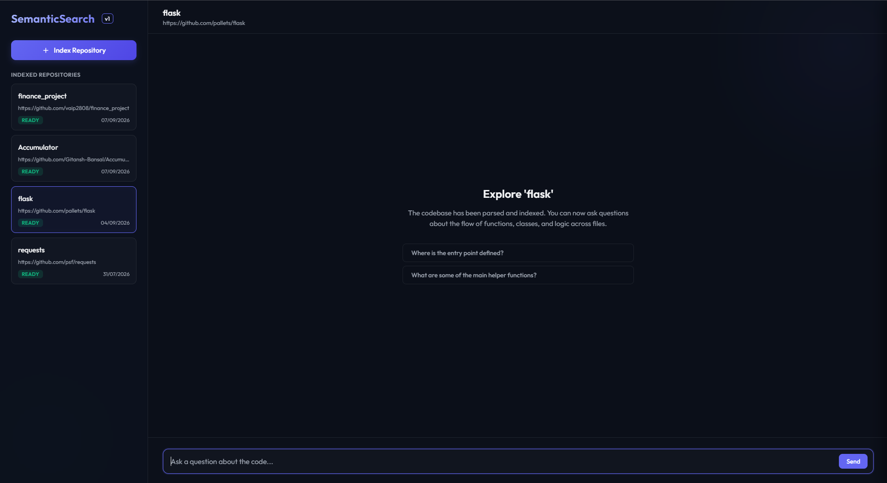

# Semantic Codebase Search Agent

Semantic Codebase Search Agent indexes a public GitHub Python repository and lets you ask natural-language questions about its implementation. It combines function-level embeddings, a static call graph, and a Groq tool-calling agent to return answers grounded in source locations and file:line citations.



_The chat interface after indexing a repository: suggested questions, live status badges, and a grounded Q&A flow._

## How It Works

```text
GitHub URL
   -> shallow clone and source filtering
   -> Python AST parsing and static call-graph storage
   -> Gemini function embeddings
   -> Groq agentic search and verification
   -> grounded answer with source citations
```

The agent has four repository tools:

- `semantic_search`: find functions whose code and context are semantically similar to a question.
- `get_callers`: inspect functions that call a selected function.
- `get_callees`: inspect functions called by a selected function.
- `get_file`: retrieve a focused source range for verification and citation.

The browser UI is served by the same FastAPI application. It provides repository indexing status, a chat surface, expandable execution traces, citation controls, and source previews.

## Setup

### Prerequisites

- Python 3.11 or newer
- Git
- A Gemini API key for embeddings
- A Groq API key for agent reasoning
- Optional: PostgreSQL with the `vector` extension for a shared deployment

For the simplest local setup, leave `DATABASE_URL` blank or unset; the app then uses SQLite automatically. PostgreSQL with pgvector is optional and is the intended path for a persistent deployment. If you keep the example PostgreSQL value, replace it with a reachable database connection string.

### Install

From the repository root:

```bash
python -m venv .venv
```

Activate the environment:

```bash
# macOS/Linux
source .venv/bin/activate

# Windows PowerShell
.venv\Scripts\Activate.ps1
```

Install the pinned dependencies:

```bash
python -m pip install -r requirements.txt
```

Create your local environment file and fill in the provider keys:

```bash
cp .env.example .env
```

On Windows PowerShell, use:

```powershell
Copy-Item .env.example .env
```

Never commit `.env`. It is ignored by the repository.

### Run the server

```bash
python main.py
```

Open <http://127.0.0.1:8000> in a browser. The API is also available through the FastAPI documentation at <http://127.0.0.1:8000/docs>.

Port `8000` must be free. To use another port, change the `port=8000` value in the `uvicorn.run` call in `main.py` and use that port in the browser and API commands below.

### Index a repository

Use the UI, or call the API directly:

```bash
curl -X POST http://127.0.0.1:8000/api/repos \
  -H "Content-Type: application/json" \
  -d '{"url":"https://github.com/psf/requests"}'
```

Indexing runs in the background through these stages:

```text
pending -> cloning -> parsing -> embedding -> ready
```

Poll the repository list or status endpoint until the repository is `ready`:

```bash
curl http://127.0.0.1:8000/api/repos
```

Then ask a question:

```bash
curl -X POST http://127.0.0.1:8000/api/repos/1/ask \
  -H "Content-Type: application/json" \
  -d '{"question":"Where is the main HTTP request sending flow implemented?"}'
```

The response includes the answer, execution trace, tool-call count, and grounding metadata. The frontend turns recognized citations into clickable source previews.

## Engineering Decisions

### Rate-limit-safe embeddings

Function embeddings are generated in batches. The embedding client retries transient rate-limit and service errors with increasing delays, and recursively splits payloads that are too large. Progress heartbeats are written between batches so long indexing jobs remain observable.

### Explicit failure states and recovery

Repository records track the active stage, last progress time, failure stage, failure timestamp, and error message. The API can safely recover failed repositories and stale in-progress records. Stale-heartbeat recovery is performed through database updates before scheduling a new background indexing task, reducing duplicate work during repeated requests.

### Grounded-answer verification

The agent is instructed to begin with `semantic_search`, trace the call graph when needed, and fetch focused source ranges before synthesizing. Answers are checked against indexed repository files and line-aware citation patterns. The UI exposes both citations and the execution trace so a reader can inspect how an answer was formed.

### Honest degraded fallback

When the reasoning provider is rate-limited or unavailable, the fallback does not invent a plausible answer. It runs the repository's semantic search directly and returns raw candidate functions with a clear degraded-mode warning. This preserves useful evidence while making the loss of full agent synthesis visible.

## Known Limitations

- **Python-only parsing:** The AST parser currently indexes Python repositories. JavaScript, TypeScript, Java, Go, and other languages are not parsed into the call graph.
- **Static call-graph ceiling:** Resolution is intentionally conservative and handles local functions, imports, aliases, classes, and some inheritance. In the measured evaluation, roughly 40% of raw call sites resolved to indexed project functions; the remainder were mostly external-library calls, dynamic dispatch, framework behavior, or genuine edge cases. The graph should be treated as useful navigation evidence, not a complete runtime call graph.
- **No incremental re-indexing:** Repository updates currently trigger a full clone, parse, and embedding workflow rather than calculating a file-level diff.
- **Provider quotas:** Free-tier Gemini and Groq limits constrain heavy indexing and multi-turn evaluation. The retry logic improves resilience but cannot remove provider quotas.
- **Shallow clone scope:** Ingestion uses a shallow clone and applies repository size/file-count limits, so very large repositories may be rejected or only partially represented.
- **Local background jobs:** Indexing uses FastAPI background tasks. A production deployment would benefit from a durable job queue and worker process with explicit cancellation and retry policy.

## Tech Stack

- FastAPI and Uvicorn for the API and static frontend server
- SQLAlchemy for persistence
- PostgreSQL with pgvector for production-style vector search
- SQLite with NumPy cosine similarity as the local fallback
- Gemini Embeddings for function-level vector representations
- Groq `openai/gpt-oss-20b` for tool-calling agent reasoning
- Python `ast` for source parsing and static call-graph extraction
- Plain HTML, CSS, and JavaScript for the browser interface

## Verification Notes

The repository includes a selected model benchmark and production decision record from the model-selection evaluation. The live smoke-tested path successfully indexed and queried `psf/requests` with grounded output and a two-tool trace. API credentials are intentionally excluded from Git; use `.env.example` as the configuration template.

## License

This project is licensed under the MIT License. See [LICENSE](LICENSE).
